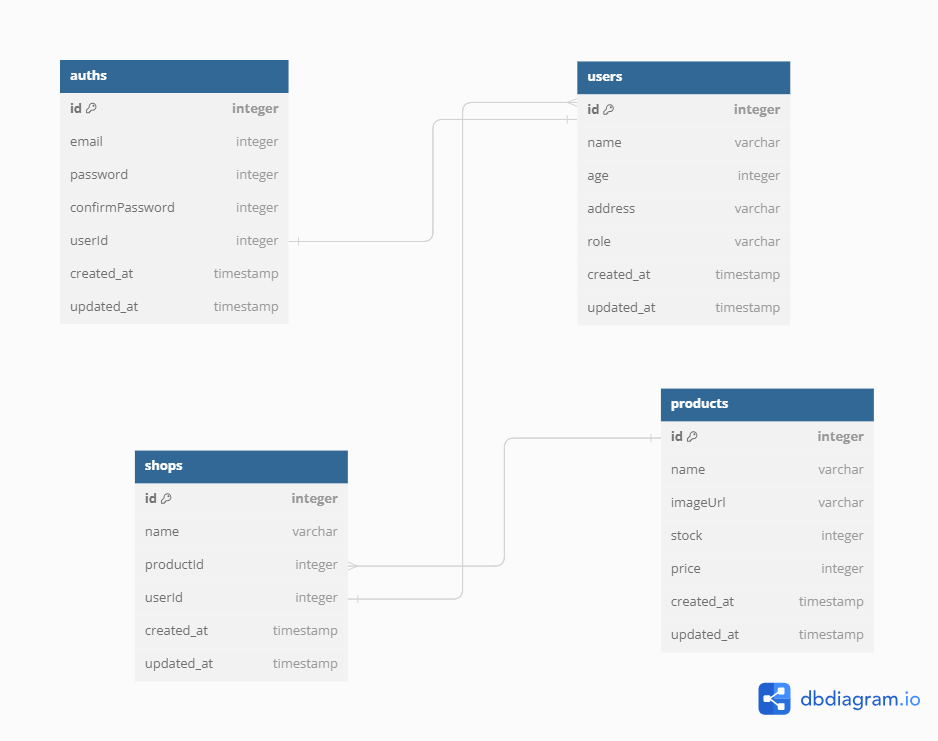

### **Judul Proyek:**

**Backend API dengan Middleware Autentikasi dan Dokumentasi Swagger**

### **Deskripsi Proyek:**

Proyek ini adalah backend aplikasi berbasis **Node.js** dan **Express.js** yang fokus pada **middleware autentikasi** menggunakan **JWT**, manajemen pengguna, dan integrasi dokumentasi API menggunakan **Swagger**. Fitur utama meliputi registrasi, login, validasi token, dan sistem health check, dengan struktur kode modular dan error handling yang terorganisasi.

### **Fitur Utama:**

1. **Autentikasi JWT:** Registrasi, login, validasi token.
2. **Dokumentasi API:** Menggunakan Swagger UI.
3. **Manajemen Pengguna:** CRUD pengguna dengan keamanan data terenkripsi.
4. **Error Handling Terstruktur:** Penanganan berbagai skenario kesalahan.
5. **Health Check Endpoint:** Memastikan aplikasi berjalan dengan baik.

### **Kompetensi yang Dipelajari:**

- Implementasi middleware autentikasi JWT.
- Penggunaan **bcrypt** untuk enkripsi password.
- Dokumentasi API menggunakan Swagger UI.
- Struktur kode modular dan validasi data pengguna.

### **Output:**

- API backend dengan autentikasi JWT dan dokumentasi Swagger.
- Middleware kustom untuk melindungi endpoint.
- Struktur proyek yang terorganisasi dan aman.

  # Langkah Langkah

- npm init
- buat bin/www (untuk start project)
- set package.json (ngebaca bi/www)
  "start": "node -r dotenv/config bin/www",
  "dev": "nodemon -r dotenv/config bin/www",
- npm install dotenv nodemon morgan express
- buat server.js

1. import modul di server.js (expresss, morgan)
   const app dan module.export
2. buat health-check || server.js

## Database Diagram

- menggunakan db diagram

  

- buat relasi model di sequelize
- npm i sequelize sequelize-cli pg pg-hstore
- npx sequlize init
- npx sequelize model:generate --name Students --attributes last_name:string,email:string,password:string
- settting validasi data yang mau asuk ke database || migrations
- npx sequelize db:migrate
- set config/config.json
- npx sequelize db:create (jika databasenya baru)
- npx sequelize db:migrate

3. middleware baca request body || server.js

noted : buat konfigurasi mvp (model, view, and controller)
